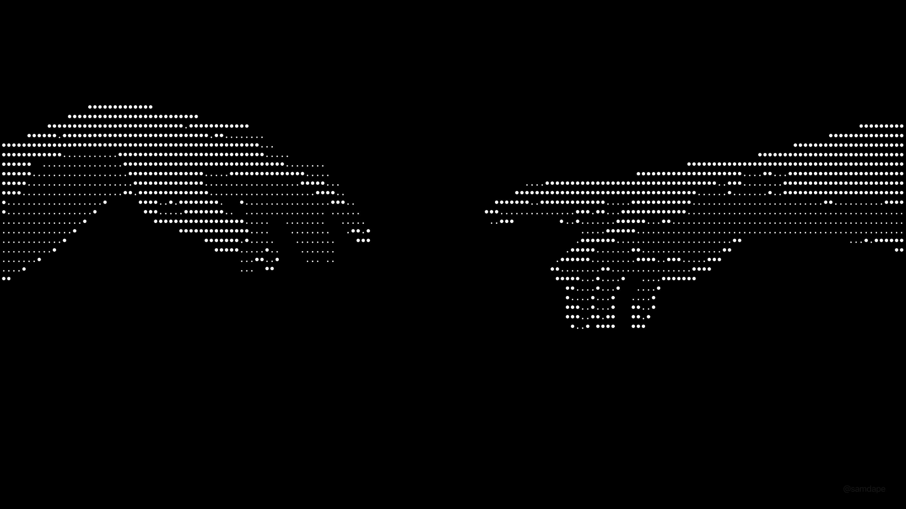

<p align="center">
<p align="center">
  
</p>
</p>

<p align="center">
  
</p>

<br/>


<p align="center">
  <a href="https://mac-os-ebum.onrender.com/" target="_blank">
    
  </a>
  &nbsp;
  <a href="https://www.linkedin.com/in/tushar-soni-852978405/" target="_blank">
    
  </a>
  &nbsp;
  <a href="mailto:tstushar342@gmail.com">
    
  </a>
  &nbsp;
  <a href="https://github.com/tusharsoni3" target="_blank">
    
  </a>
</p>

<p align="center">
  
  &nbsp;
  
</p>

---

## `$ About.txt`

> Backend Engineer specializing in **API systems, real-time infrastructure, and distributed backend design**. I build production-grade Node.js services with a focus on security, scalability, and clean architecture. Final-year B.Tech student at JUET actively shipping portfolio systems and exploring Go for high-performance microservices.

```bash
ROLE        →  Backend Engineer  (Fresher · Class of 2027)
STACK       →  Node.js · TypeScript · Go · PostgreSQL · Redis · Docker · AWS
OPEN_TO     →  Backend SDE · Node.js Engineer · Full-time · Remote OK
```

---

## `$ ls tech-stack/`
<div align="center">
  
**Languages**
  
<p>
  
</p>

**Frameworks & Runtime**
<p>
  
</p>

**Databases & Caching**
<p>
  
</p>

**DevOps & Cloud**
<p>
  
</p>

**Tools & Workflow**
<p>
  
</p>
</div>


## `$ ls projects/`

<details open>
<summary><b>⬡ GateX — Self-Hosted API Gateway Platform</b></summary>
<br>

> A production-ready, self-hosted API Gateway with reverse proxying, Redis caching, sliding-window rate limiting, and real-time analytics — a lightweight Kong/NGINX alternative for Node.js backends.

| Property | Details |
|:---------|:--------|
| **Stack** | Node.js · TypeScript · Express · Redis · PostgreSQL · Drizzle ORM · Docker |
| **Infrastructure** | Neon DB (serverless PG) · Redis Cloud · Idle connection crash recovery |
| **Key Features** | Reverse proxy · Redis cache-aside API key validation · Sliding window rate limiting via Redis sorted sets · Async logging pipeline (Redis queue → PG bulk inserts) · Analytics endpoints |
| **Architecture** | ES module isolation via dedicated `env.js` · SSL-secure Redis config · Neon idle-connection handling |
| **Repo** | [github.com/tusharsoni3/apigateway](https://github.com/tusharsoni3/apigateway) |

<p>
  
  
  
  
  
</p>
</details>

<details>
<summary><b>⬡ EncryptedChat — End-to-End Encrypted Real-time Chat</b></summary>
<br>

> A real-time E2EE chat application with military-grade encryption, AI-suggested replies, offline message queuing, and production-grade delivery guarantees.

| Property | Details |
|:---------|:--------|
| **Stack** | Node.js · Socket.io · Redis · BullMQ · PostgreSQL · Passport.js |
| **Encryption** | AES-256-GCM for messages · RSA-OAEP for per-session key exchange |
| **AI Layer** | Gemini API for context-aware AI-suggested replies |
| **Features** | Google OAuth · Redis TTL heartbeat presence · Offline BullMQ queue · Delivery receipts · Idempotency keys |
| **DevOps** | GitHub Actions CI/CD pipeline · Dockerized deployment |

<p>
  
  
  
  
  
</p>
</details>

<details>
<summary><b>⬡ Game Backend Platform — Multiplayer BaaS (In Development 🚧)</b></summary>
<br>

> A mini PlayFab/GameSparks clone — microservices architecture covering player management, matchmaking, leaderboard, game-state sync, and anti-cheat.

| Property | Details |
|:---------|:--------|
| **Stack** | Node.js · Go · PostgreSQL · Redis · Docker · Message Broker (TBD) |
| **Services** | Player Management · Matchmaking Engine · Real-time Leaderboard · Game State Sync · Anti-Cheat Layer |
| **Status** | 🚧 Active Development |

<p>
  
  
  
  
  
</p>
</details>


## `$ Connect With ME `

<p align="center">
  <a href="mailto:tstushar342@gmail.com">
    
  </a>
  &nbsp;
  <a href="https://www.linkedin.com/in/tushar-soni-852978405/">
    
  </a>
  &nbsp;
  <a href="https://mac-os-ebum.onrender.com/">
    
  </a>
  &nbsp;
  <a href="https://github.com/tusharsoni3">
    
  </a>
</p>

<p align="center">
  <em>"There's always more to learn"</em>
</p>

